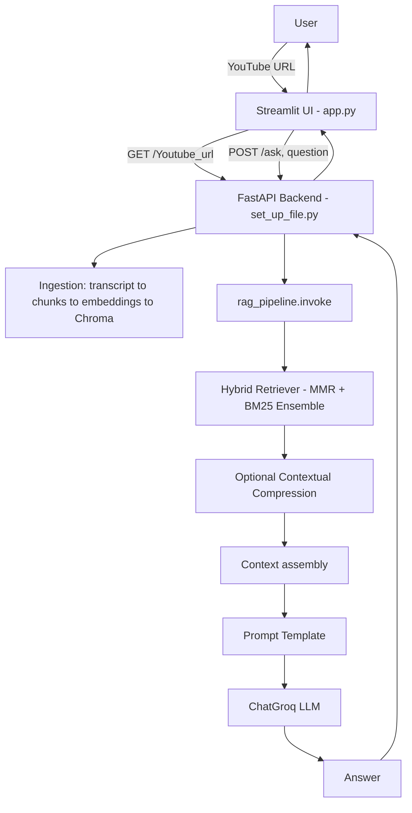
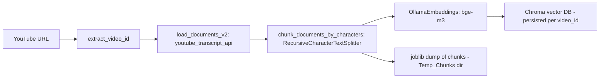
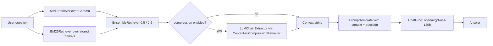
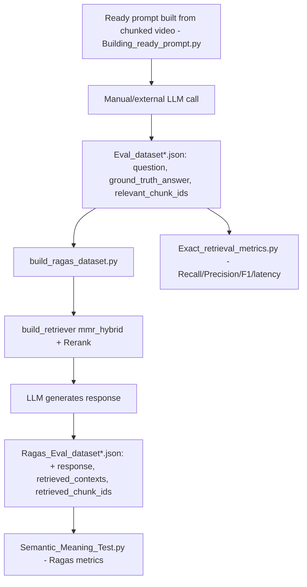
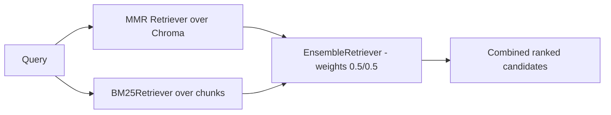

# YouTube Video RAG Assistant

A Retrieval-Augmented Generation (RAG) system that turns any YouTube video's transcript into a queryable knowledge base. Users submit a YouTube URL through a Streamlit interface, the backend ingests and indexes the transcript, and users can then ask natural-language questions and receive grounded answers with a hybrid vector + keyword retrieval pipeline and cross-encoder reranking.

> Directory names such as `Retreivers` are preserved exactly as they appear in the source code (this is a typo in the original project, kept intentionally for documentation accuracy).

---

## 2. Project Overview

This project implements an end-to-end **RAG (Retrieval-Augmented Generation) pipeline over YouTube video transcripts**. A user provides a YouTube URL; the system fetches the video's transcript, splits it into chunks, embeds those chunks, and stores them in a persistent Chroma vector database. When the user asks a question, the system retrieves the most relevant chunks using a **hybrid retrieval strategy** (dense vector search combined with BM25 keyword search via an `EnsembleRetriever`), optionally reranks them with a **cross-encoder**, and passes the resulting context to an LLM (`ChatGroq`) to generate a grounded, context-only answer.

**Why RAG is used:** LLMs cannot answer questions about the specific content of a video they were not trained on. RAG grounds the model's answer in the actual transcript text retrieved for the question, reducing hallucination and enabling video-specific Q&A.

**Type of data:** Unstructured, single-document, conversational transcript text extracted from YouTube (English or Arabic), turned into semantically meaningful chunks.

**What makes this implementation technically interesting:**
- A pluggable retriever **factory** (`Retreivers/factory.py`) that can build similarity, MMR, hybrid (vector + BM25), multi-query, and contextual-compression retrievers from a single configuration call.
- A **dedicated evaluation subsystem**, separate from the chatbot pipeline, that measures both classic IR metrics (Recall/Precision/F1, using exact chunk-ID matching) and RAG-quality metrics (via `ragas`: Context Precision, Context Recall, Faithfulness, Answer Relevancy).
- A **local-first model stack** (Ollama for embeddings, sentence-transformers cross-encoder for reranking) combined with an **API-based LLM** (Groq) for generation — a hybrid local/cloud deployment pattern.
- Two independent transcript-loading implementations (`load_documents` and `load_documents_v2`), with `load_documents_v2` used in production for improved reliability.

---

## 3. Key Features

Only features that are implemented in the uploaded code are listed here.

- **YouTube transcript ingestion** with automatic language fallback (English → Arabic), via two implementations: `langchain_community.YoutubeLoader` (`load_documents`) and direct `youtube_transcript_api` usage (`load_documents_v2`).
- **Persistent vector storage per video** using Chroma, keyed by video ID, so a previously processed video is loaded from disk instead of being re-ingested.
- **Two chunking strategies**: semantic chunking (`SemanticChunker`, embedding-based breakpoints) and fixed-size character chunking (`RecursiveCharacterTextSplitter`), plus a token-based splitter utility.
- **Five retrieval strategies** selectable through one factory function: `similarity`, `mmr`, `similarity_hybrid`, `mmr_hybrid` (default in production), each of which can optionally be wrapped with **multi-query expansion** and/or **contextual compression**.
- **Hybrid (ensemble) retrieval**: combines a dense retriever (similarity or MMR) with a `BM25Retriever` using `EnsembleRetriever` with equal (0.5/0.5) weighting.
- **Cross-encoder reranking** (`cross-encoder/ms-marco-MiniLM-L-6-v2`) that re-scores retrieved documents against the query before the final Top-K is selected.
- **REST API backend** (FastAPI) exposing `GET /Youtube_url` (ingest/prepare a video) and `POST /ask` (ask a question against the currently loaded video).
- **Streamlit chat frontend** (`app.py`) that talks to the FastAPI backend over HTTP, with a URL-submission screen and a chat screen.
- **Retrieval latency instrumentation** inside `rag_pipeline.invoke()`: retrieval time, prompt-build time, and generation time are each measured and printed.
- **Exact-match retrieval evaluation** (`Exact_retrieval_metrics.py`): computes Recall, Precision, and F1 against hand-labeled `relevant_chunk_ids`, plus retrieval latency, averaged across a dataset.
- **RAG-quality evaluation via Ragas** (`Semantic_Meaning_Test.py`): Context Precision, Context Recall, Answer Relevancy, and Faithfulness, using a Groq-hosted LLM and an Ollama embedding model as the judge/evaluator backends.
- **Evaluation dataset construction pipeline** (`build_ragas_dataset.py`): runs the retrieval + reranking + generation pipeline over a labeled question set and writes out a Ragas-compatible dataset (`response`, `retrieved_contexts`, `retrieved_chunk_ids`) for later scoring.
- **LLM-assisted evaluation-dataset authoring helper** (`Building_ready_prompt.py` + `Dataset_Generation_Prompt` in `utils.py`): ingests a video, chunks it, assigns chunk IDs, and produces a ready-to-use prompt string instructing an LLM to generate 10 QA pairs with `relevant_chunk_ids` — the prompt is generated by the code, but the JSON dataset itself is produced by pasting that prompt into an LLM **outside** this codebase. `[Needs clarification]`: no script in the uploaded files actually calls an LLM with this prompt and writes the resulting JSON to disk automatically.

---

## 4. System Architecture

### 4.1 High-Level Architecture



### 4.2 Ingestion Pipeline



### 4.3 Query Pipeline



### 4.4 Evaluation Pipeline



---

## 5. Project Structure

The uploaded files do not include explicit folder paths — only flat filenames plus the import statements inside them (e.g. `from Ingestion.chunker import ...`, `from Retreivers.factory import ...`) and `sys.path` manipulations that reveal file depth. The tree below is **reconstructed from those import statements and path calculations**; exact folder names for the evaluation scripts are inferred and marked accordingly.

```text
project_root/
├── app.py                          # Streamlit frontend (chat UI, calls FastAPI backend)
├── set_up_file.py                  # FastAPI backend entry point (app, config, /Youtube_url, /ask)
├── Building_ready_prompt.py        # Builds an LLM-ready prompt for generating eval datasets
│
├── Ingestion/
│   ├── utils.py                    # Chunk ID assignment, chunk persistence, Dataset_Generation_Prompt template
│   ├── youtube_loader.py           # load_documents (v1) and load_documents_v2 (production) transcript loaders
│   ├── chunker.py                  # chunk_documents (semantic), chunk_documents_by_tokens, chunk_documents_by_characters
│   └── Vector_DB.py                # creat_vector_DB, load_vector_DB (Chroma wrappers)
│
├── Pipeline/
│   └── rag_pipeline.py             # rag_pipeline class: retrieval -> prompt -> LLM -> answer, with latency logging
│
├── Retreivers/                     # [sic] — typo preserved from source
│   ├── factory.py                  # build_retriever(): single entry point selecting retrieval strategy
│   ├── mmr.py                      # build_mmr_retrievers(): MMR search over Chroma
│   ├── similarity.py               # build_similarity_retriever(): plain similarity search over Chroma
│   ├── Build_BM25_retriever.py     # build_BM25Retriever(): lexical retriever over raw documents
│   ├── hybrid_search_retriever.py  # build_ensemble_retriever(): combines two retrievers (EnsembleRetriever)
│   ├── multi_query_retriever.py    # build_multi_query_retriever(): LLM-based query expansion wrapper
│   └── compression.py              # build_compression_retriever(): LLM-based contextual compression wrapper
│
├── Reranking/
│   └── reranker.py                 # Rerank(): cross-encoder scoring and Top-K selection
│
└── Evaluation/  [Needs clarification: exact folder name inferred from sys.path depth]
    ├── Exact_retrieval_metrics.py  # Recall/Precision/F1 + latency over labeled eval datasets
    ├── build_ragas_dataset.py      # Runs pipeline over eval questions, writes Ragas-format dataset
    └── Semantic_Meaning_Test.py    # Ragas metric scoring (Context Precision/Recall, Faithfulness, Answer Relevancy)
```

**Directory responsibilities:**
- **`Ingestion/`** — everything from raw YouTube URL to a populated vector database: transcript loading, chunking, chunk-ID/metadata handling, and vector store creation/loading.
- **`Pipeline/`** — orchestrates a single end-to-end question-answer turn using an already-built retriever and LLM.
- **`Retreivers/`** — all retrieval strategy implementations plus the `factory.py` module that composes them based on a configuration.
- **`Reranking/`** — the cross-encoder reranking stage applied after retrieval.
- **`Evaluation/`** *(inferred)* — offline scripts that are not part of the live chatbot request path; they measure retrieval quality (exact metrics) and generation quality (Ragas metrics), and build the labeled datasets those measurements run against.
- **Top level** — the two application entry points: `set_up_file.py` (FastAPI backend / API surface) and `app.py` (Streamlit UI), plus `Building_ready_prompt.py`, a standalone dataset-authoring helper.

---

## 6. Technologies Used

| Technology | Purpose |
|---|---|
| Python | Primary implementation language for the entire project. |
| FastAPI | Backend REST API (`set_up_file.py`) exposing ingestion and question-answering endpoints. |
| Streamlit | Frontend chat UI (`app.py`) that calls the FastAPI backend over HTTP. |
| LangChain (`langchain_core`, `langchain_community`, `langchain_classic`, `langchain_text_splitters`, `langchain_experimental`) | Document abstraction, prompt templates, retrievers (`EnsembleRetriever`, `BM25Retriever`, `MultiQueryRetriever`, `ContextualCompressionRetriever`, `LLMChainExtractor`), and text splitters (`RecursiveCharacterTextSplitter`, `TokenTextSplitter`, `SemanticChunker`). |
| `langchain_chroma` | Chroma vector store integration (`Chroma.from_documents`, `Chroma(...)`). |
| `langchain_ollama` | `OllamaEmbeddings` (embedding generation) and `OllamaLLM` (a locally-run LLM, used only in an unused module-level config in `rag_pipeline.py`). |
| `langchain_groq` | `ChatGroq` — the production LLM client used for answer generation and evaluation-dataset generation. |
| Ollama | Local model runtime serving the `bge-m3` embedding model. |
| Chroma | Persistent vector database storing chunk embeddings per video. |
| BM25 (via `langchain_classic.retrievers.BM25Retriever`) | Lexical/keyword retrieval, combined with dense retrieval for hybrid search. |
| Sentence-Transformers (`CrossEncoder`) | Cross-encoder reranking model (`cross-encoder/ms-marco-MiniLM-L-6-v2`). |
| `youtube_transcript_api` | Direct transcript fetching used by `load_documents_v2`. |
| `joblib` | Serializing/deserializing chunk lists to/from disk (`dump`/`load`). |
| `python-dotenv` | Loading environment variables (API keys) from a `.env` file. |
| `ragas` | RAG evaluation framework: `SingleTurnSample`, `llm_factory`, `embedding_factory`, and the `ContextRecall`, `ContextPrecision`, `AnswerRelevancy`, `Faithfulness` metrics. |
| `openai` (AsyncOpenAI client) | Used as the HTTP client shape for both the Groq API and the local Ollama OpenAI-compatible endpoint, feeding `ragas`'s `llm_factory`/`embedding_factory`. |
| `requests` | HTTP calls from the Streamlit frontend to the FastAPI backend. |
| `pydantic` | Request body validation (`QuestionRequest`) in the FastAPI backend. |

---

## 7. Models

| Model | Role | Used In | Input | Output | Why Used |
|---|---|---|---|---|---|
| `openai/gpt-oss-120b` (via `ChatGroq`) | Primary generation LLM | `set_up_file.py` config, `build_ragas_dataset.py` config | Prompt (context + question) | Generated answer | Produces the final grounded answer from retrieved context; also used to generate answers for the Ragas evaluation dataset. |
| `openai/gpt-oss-20b` (via `ChatGroq`) | Evaluation-time LLM | `Exact_retrieval_metrics.py` config, `Semantic_Meaning_Test.py` (as `llm_evaluator` via `llm_factory`) | Retriever config / Ragas metric prompts | Retriever object (as LLM for compression, if enabled) / Ragas metric scores | A smaller model used specifically for evaluation flows, separate from the production 120b model. `[Needs clarification]`: the choice of a smaller model for evaluation vs. production is not explained in code comments. |
| `bge-m3` (via `OllamaEmbeddings`, served by Ollama) | Embedding model | `Vector_DB.py` (indexing), `factory`/retrievers (query embedding at query time), `Semantic_Meaning_Test.py` (`embedding_factory`, used by `AnswerRelevancy`) | Text chunks / queries | Dense vector embeddings | Runs locally via Ollama, avoiding per-embedding API cost/latency for a potentially large number of transcript chunks. |
| `cross-encoder/ms-marco-MiniLM-L-6-v2` (via `sentence_transformers.CrossEncoder`) | Reranker | `Reranking/reranker.py`, used from `Exact_retrieval_metrics.py` and `build_ragas_dataset.py` | (query, document) pairs | Relevance scores | Cross-encoders score a query against a document jointly, producing more accurate relevance ranking than embedding similarity alone; used to refine the hybrid retriever's candidate set before final Top-K selection. |
| `qwen3:1.7b` (via `OllamaLLM`) | Declared but unused | Module-level `config` dict in `rag_pipeline.py` | — | — | This config dict is defined at import time in `rag_pipeline.py` but is never referenced by the `rag_pipeline` class, which receives its `llm` and `retriever` as constructor arguments instead. Appears to be leftover/dead code. `[Needs clarification]`. |

---

## 8. Installation

**Python version:** Not explicitly pinned anywhere in the uploaded files. `[Needs clarification]` — use a recent Python 3.10+ as a reasonable default given the LangChain/FastAPI ecosystem in use.

### 8.1 Virtual Environment

```bash
python -m venv venv
source venv/bin/activate        # Windows: venv\Scripts\activate
```

### 8.2 Required Packages

No `requirements.txt` or `pyproject.toml` was included in the uploaded files, so the package list below is derived directly from the `import` statements found in the source code. `[Needs clarification]`: exact version pins are unknown.

```bash
pip install fastapi uvicorn streamlit requests pydantic python-dotenv joblib
pip install langchain-core langchain-community langchain-classic langchain-text-splitters langchain-experimental
pip install langchain-chroma langchain-ollama langchain-groq
pip install chromadb sentence-transformers youtube-transcript-api
pip install ragas openai
```

`uvicorn` is required to actually serve the FastAPI `app` object (no `if __name__ == "__main__"` block with `uvicorn.run(...)` was found in `set_up_file.py`, so the run command must be issued externally — see Section 10).

### 8.3 Ollama Requirements (Local Models)

- Install [Ollama](https://ollama.ai) and ensure the service is running.
- Pull the embedding model referenced in the code:
  ```bash
  ollama pull bge-m3
  ```
- The `qwen3:1.7b` model referenced in `rag_pipeline.py`'s unused module-level config is **not required** for the app to function, since that config object is never used.

### 8.4 Local vs. API-Based Models

| Model | Type | Requirement |
|---|---|---|
| `bge-m3` embeddings | Local (Ollama) | Ollama running locally with the model pulled. |
| `cross-encoder/ms-marco-MiniLM-L-6-v2` | Local (downloaded by `sentence-transformers` on first use) | Internet access on first run to download weights; runs locally afterward. |
| `openai/gpt-oss-120b`, `openai/gpt-oss-20b` | API-based (Groq) | A valid Groq API key. |
| Ragas evaluator/embedding factories | API-based (via `AsyncOpenAI` pointed at Groq) and local (via `AsyncOpenAI` pointed at `http://localhost:11434/v1`, i.e. Ollama's OpenAI-compatible endpoint) | Groq API key + local Ollama server running. |

---

## 9. Environment Variables

| Variable | Used In | Purpose |
|---|---|---|
| `Groq_api_key` | `set_up_file.py`, `Exact_retrieval_metrics.py`, `build_ragas_dataset.py`, `Semantic_Meaning_Test.py` | The Groq API key, read via `os.getenv(key="Groq_api_key")`. Note the non-standard casing/name (not `GROQ_API_KEY`) — this is the literal key name used in `.env` by this project. |

In `set_up_file.py`, this value is additionally copied into the standard `GROQ_API_KEY` environment variable (`os.environ["GROQ_API_KEY"] = os.getenv("Groq_api_key")`) because the `ChatGroq(...)` instantiation in that file's `config` dict does **not** pass an explicit `api_key` argument, and `ChatGroq` falls back to reading `GROQ_API_KEY` from the environment. In `Exact_retrieval_metrics.py` and `build_ragas_dataset.py`, `ChatGroq` is instead given `api_key=os.getenv(key="Groq_api_key")` directly.

Example `.env` file:

```env
Groq_api_key=your_groq_api_key_here
```

No other environment variables (database URLs, secondary API keys, etc.) were found in the uploaded files.

---

## 10. Running the Project

### First-Time Setup

1. Complete the installation steps in Section 8 (virtual environment, packages, Ollama + `bge-m3` model).
2. Create a `.env` file at the project root containing `Groq_api_key=...`.
3. Update the hardcoded paths in `set_up_file.py` (`DATASETS_DIR`, `CHUNKS_DIR`) — these are currently Windows-specific absolute paths (`D:/Youtube rag system/Datasets`, `D:/Youtube rag system/Temp_Chunks`) and must exist or be changed for your environment.

### Creating the Vector Database

The vector database is created automatically, per video, the first time a given YouTube URL is submitted — there is no separate standalone "build the DB" script for the live chatbot flow. This happens inside `get_rag_pipeline()` in `set_up_file.py` when `os.path.exists(database_path)` is `False`.

### Running the Backend (FastAPI)

`set_up_file.py` defines a FastAPI `app` object but does not include a `uvicorn.run(...)` launch block, so it must be started with `uvicorn` directly:

```bash
uvicorn set_up_file:app --reload
```

`[Needs clarification]`: the exact module path/filename to pass to `uvicorn` depends on where `set_up_file.py` actually lives relative to your working directory when the app is added to a real package structure.

### Running the Chatbot (Streamlit Frontend)

With the FastAPI backend running on `http://127.0.0.1:8000` (the URL hardcoded in `app.py`'s `FASTAPI_URL`):

```bash
streamlit run app.py
```

### Running Evaluation

These are standalone scripts, run directly with Python, **not** through the FastAPI/Streamlit apps:

```bash
python Exact_retrieval_metrics.py      # Recall / Precision / F1 / latency over labeled eval datasets
python build_ragas_dataset.py          # Builds Ragas-format datasets (generates answers + retrieved contexts)
python Semantic_Meaning_Test.py        # Scores Ragas metrics on a pre-built Ragas dataset
```

Both `Exact_retrieval_metrics.py` and `build_ragas_dataset.py` reference hardcoded Windows paths (e.g. `D:/Youtube rag system/Databases/vid1_DB`, `D:/Youtube rag system/Evaluation/Eval_dataset1.json`) for three specific videos (`vid1`, `vid2`, `vid3`). These paths, and the corresponding `Eval_dataset*.json` files, must exist before running.

### Running Retrieval Experiments

Retrieval strategy can be changed by editing the `search_type` argument passed to `build_retriever(...)` (in `set_up_file.py`, `Exact_retrieval_metrics.py`, or `build_ragas_dataset.py`) to one of: `"similarity"`, `"mmr"`, `"similarity_hybrid"`, `"mmr_hybrid"`. There is no CLI flag or config file for this — it is a direct code edit.

---

## 11. Ingestion Pipeline

```text
YouTube URL
↓  extract_video_id() — parses video ID from the URL (query param `v=`, or path segment for youtu.be links)
↓  load_documents_v2() — fetches available transcripts via youtube_transcript_api, prefers English then Arabic,
   wraps the joined transcript text into a single LangChain Document with metadata {video_id, language, is_generated}
↓  chunk_documents_by_characters() — RecursiveCharacterTextSplitter (chunk_size=1000, chunk_overlap=150 in
   set_up_file.py's production path), splitting on paragraph/sentence/word boundaries with Arabic-aware
   separators (["\n\n","\n","؟","!",".","،"," ",""])
↓  OllamaEmbeddings("bge-m3") — embeds each chunk
↓  creat_vector_DB() — Chroma.from_documents(...), persisted to disk at a per-video directory
   (collection_name=f"new_vid_{video_id}", persist_directory=.../new_vid_{video_id})
↓  joblib.dump() of the raw chunk list to CHUNKS_DIR — kept separately because BM25 needs the original
   documents/text, not just vectors
```

On a **second** request for the same video, `get_rag_pipeline()` detects the existing `database_path` and instead calls `load_vector_DB()` plus `joblib.load()` on the saved chunks, skipping re-ingestion entirely.

---

## 12. Chunking Strategy

Three chunking functions exist in `Ingestion/chunker.py`:

- **`chunk_documents(documents, embeddings, breakpoint_threshold_type, breakpoint_threshold_amount)`** — uses `SemanticChunker` from `langchain_experimental`, which splits text based on embedding-distance breakpoints between sentences rather than fixed sizes. This is the method used in `Building_ready_prompt.py`'s dataset-authoring flow, and is present (commented out) in `set_up_file.py` as an alternative to the character-based method.
- **`chunk_documents_by_tokens(documents, chunk_size=500, chunk_overlap=50)`** — `TokenTextSplitter`, splits by token count. `[Needs clarification]`: not called from any other file in the uploaded set; appears to be an available-but-unused utility.
- **`chunk_documents_by_characters(documents, chunk_size=500, chunk_overlap=50)`** — `RecursiveCharacterTextSplitter` with separators `["\n\n","\n","؟","!",".","،"," ",""]` (Arabic-aware punctuation included). **This is the method actually used in production** (`set_up_file.py`), called with `chunk_size=1000, chunk_overlap=150`.

**Chunk metadata / chunk IDs:** `assign_ids()` in `Ingestion/utils.py` writes `chunk.metadata['chunk_id'] = f"chunk_No:{index}"` onto each chunk, in document order. This is used by the evaluation scripts (`Exact_retrieval_metrics.py`, `build_ragas_dataset.py`) to match retrieved chunks against a labeled set of `relevant_chunk_ids`. `[Needs clarification]`: `assign_ids()` is called in `Building_ready_prompt.py`'s flow but there is no equivalent call visible in `set_up_file.py`'s live ingestion path (`get_rag_pipeline`) — meaning chunk IDs used at evaluation time and chunk IDs (if any) present at live-serving time may originate from different code paths.

---

## 13. Embedding Pipeline

- **Model:** `bge-m3`, served locally through Ollama, wrapped by `langchain_ollama.OllamaEmbeddings(model="bge-m3", keep_alive=-1)` (`keep_alive=-1` keeps the model loaded in Ollama indefinitely rather than unloading after idle time).
- **When generated:** Once per chunk, at ingestion time, inside `Chroma.from_documents(...)` (`creat_vector_DB`), which computes and stores embeddings for all chunks of a new video in a single call.
- **How stored:** Persisted to disk by Chroma at `persist_directory=.../new_vid_{video_id}`, one collection per video (`collection_name=f"new_vid_{video_id}"`).
- **Query-time embeddings:** Generated implicitly by Chroma's retriever (`vector_db.as_retriever(...)`) using the same `OllamaEmbeddings` instance passed in when the vector store was loaded/created — there is no separate manual query-embedding step in the code.

---

## 14. Retrieval System

All retrieval strategies are selected through a single entry point, `build_retriever()` in `Retreivers/factory.py`.

### Similarity Search

`Retreivers/similarity.py` — `build_similarity_retriever(vector_db, k)` calls `vector_db.as_retriever(search_type="similarity", search_kwargs={"k": k})`. Standard dense nearest-neighbor search over the Chroma collection, returning the `k` most similar chunks by embedding distance.

### MMR (Maximal Marginal Relevance)

`Retreivers/mmr.py` — `build_mmr_retrievers(vector_db, k, fetch_k, lambda_mult)` calls `vector_db.as_retriever(search_type="mmr", search_kwargs={"k": k, "fetch_k": fetch_k, "lambda_mult": 0.5})`.

- **`k`** — number of chunks finally returned.
- **`fetch_k`** — a larger candidate pool fetched before MMR re-selection (e.g. `k=3, fetch_k=5` in `set_up_file.py`).
- **`lambda_mult`** — trade-off between relevance and diversity (0 = max diversity, 1 = max relevance). **Note:** although `lambda_mult` is accepted as a function parameter, the implementation hardcodes `'lambda_mult': 0.5` inside `search_kwargs` instead of using the passed-in value — the caller's `lambda_mult` argument is effectively ignored. This is a behavior worth flagging for anyone tuning this parameter.
- **Why used:** MMR reduces redundancy among retrieved chunks compared to plain similarity search, which is useful when a transcript contains repeated or overlapping statements of the same idea.

### BM25

`Retreivers/Build_BM25_retriever.py` — `build_BM25Retriever(documents, k)` calls `BM25Retriever.from_documents(documents=documents, k=k)`. This is a **lexical/keyword** retriever built directly from the in-memory chunk list (not from the vector DB), so it requires the original `Document` objects to be available at query time — hence the separate `joblib` persistence of chunks alongside the Chroma DB.

### Hybrid Search

`Retreivers/hybrid_search_retriever.py` — `build_ensemble_retriever(retriever1, retriever2)` wraps two retrievers in a `langchain_classic.retrievers.EnsembleRetriever` with equal weights `[0.5, 0.5]`. In `factory.py`, this is used to combine either (similarity + BM25) for `search_type="similarity_hybrid"`, or (MMR + BM25) for `search_type="mmr_hybrid"` — the latter is the strategy actually used in `set_up_file.py`'s production pipeline. `EnsembleRetriever` merges and re-ranks results from both retrievers (rank fusion), so the hybrid retriever benefits from both semantic similarity and exact keyword overlap.



### Multi Query

`Retreivers/multi_query_retriever.py` — `build_multi_query_retriever(llm, retriever)` wraps any retriever with `langchain_classic.retrievers.multi_query.MultiQueryRetriever.from_llm(llm=llm, retriever=retriever)`. `MultiQueryRetriever` uses the given LLM to generate multiple reformulations of the user's question and retrieves for each, then de-duplicates the union of results — intended to reduce sensitivity to exact query phrasing. In `factory.py`, this wrapper is only applied `if multi_query:` is truthy; in every call site found in the uploaded files, `multi_query=None` is passed, so **this wrapper is implemented but not currently activated** in the live pipeline or evaluation scripts.

### Compression

`Retreivers/compression.py` — `build_compression_retriever(llm, base_retriever)` wraps a retriever in `ContextualCompressionRetriever` using `LLMChainExtractor.from_llm(llm=llm)` as the compressor. This uses the LLM to extract only the sentences/passages relevant to the query from each retrieved document, shrinking the context before it reaches the generation prompt. In `factory.py`, applied `if compression:` is truthy. In `set_up_file.py`, `compression=True` is passed only in the **load-existing-database** branch of `get_rag_pipeline()`, not in the **first-time ingestion** branch (which passes `compression=None`) — meaning a freshly ingested video's first answer pipeline skips compression, while subsequent runs against an already-indexed video use it.

---

## 15. Reranking

`Reranking/reranker.py` implements `Rerank(reranker_model, query, docs, Top_k)`:

```text
Retrieved candidates (from the hybrid retriever)
↓  Build (query, doc.page_content) pairs for every retrieved document
↓  reranker_model.predict(inputs=pairs) — CrossEncoder scores each pair jointly
↓  Sort (score, doc) pairs in descending order by score
↓  Take the first Top_k documents
```

The cross-encoder used is `cross-encoder/ms-marco-MiniLM-L-6-v2`. Reranking differs from embedding-based retrieval in that a cross-encoder processes the query and each candidate document **together** in a single forward pass, letting it model fine-grained query-document interactions — this is typically more accurate than comparing independently computed embedding vectors, but far more computationally expensive per pair, which is why it is applied only to a small candidate set (the output of the hybrid retriever) rather than the whole collection.

`[Needs clarification]`: `Rerank()` is called explicitly from `Exact_retrieval_metrics.py` and `build_ragas_dataset.py`, but is **not** invoked from the live `set_up_file.py` chatbot path — the live `/ask` endpoint's `rag_pipeline` uses the hybrid retriever's output directly (optionally passed through compression), without a separate reranking step.

---

## 16. RAG Pipeline

Implemented in `Pipeline/rag_pipeline.py`, class `rag_pipeline`, constructed with an `llm` and a `retriever` (both injected — no defaults are read from the module-level `config` dict, which is unused).

```text
Question
↓  self.retriever.invoke(input=question)              [retrieval_start / retrieval_end timed]
↓  context = "\n\n".join(doc.page_content for doc in docs)
↓  PromptTemplate.invoke({'question': question, 'context': context})   [build_prompt timed]
↓  self.llm.invoke(input=ready_prompt)                 [generation timed]
↓  Answer (returned as the LLM's raw response object; set_up_file.py's /ask endpoint reads .content from it)
```

The prompt template used (verbatim structure, reproduced from source) instructs the model to:
- Answer only from the provided context.
- Answer in the same language as the question (English or Arabic), keeping technical/domain terms in their original English form when that is standard, without duplicating terms in both languages.
- State that the information is not available in the context if the answer cannot be found there.

Latency for each of the three stages (retrieval, prompt construction, generation) is printed to stdout after every call.

---

## 17. Evaluation Framework

The evaluation subsystem is entirely separate from the live chatbot request path — it consists of standalone scripts run manually against labeled datasets.

### Evaluation Dataset Format

An `Eval_dataset*.json` file is a JSON array of objects, each with:
- `question` (string)
- `ground_truth_answer` (string)
- `relevant_chunk_ids` (array of strings) — the hand-labeled correct chunk IDs for that question.

These datasets' *content* is produced by pasting the prompt generated by `Building_ready_prompt.py` (which embeds the `Dataset_Generation_Prompt` template from `utils.py`) into an LLM outside the codebase; no script in the uploaded files calls an LLM and writes this JSON automatically. `[Needs clarification]`.

`build_ragas_dataset.py` augments each item with:
- `response` (the LLM's generated answer)
- `retrieved_contexts` (list of retrieved chunk text)
- `retrieved_chunk_ids` (list of retrieved chunk IDs)

and writes the result to a `Ragas_Eval_dataset*.json` file, which is what `Semantic_Meaning_Test.py` consumes.

### Retrieval Evaluation — Exact Metrics

Implemented in `Exact_retrieval_metrics.py`, function `calc_recall_precesion_f1_score(relevant_chunks, retrieved_chunks)` [name preserved as spelled in source]:

- **Recall** = `|relevant ∩ retrieved| / |relevant chunks|`
- **Precision** = `|relevant ∩ retrieved| / |retrieved chunks|`
- **F1** = `2 × Precision × Recall / (Precision + Recall)`

All three are expressed as percentages (multiplied by 100) in the implementation. If the intersection between relevant and retrieved chunk sets is empty, all three metrics are set to `0` directly (avoiding a division-by-zero on the F1 calculation).

`Test_Retrieval_process()` iterates over each labeled question, builds a fresh `mmr_hybrid` retriever with `k = fetch_k/2 = len(relevant_chunk_ids)` (i.e., sized to the number of labeled relevant chunks for that specific question), retrieves, reranks the result down to `Top_k = len(relevant_chunk_ids)` with `Rerank()`, computes the three metrics per question, and reports the **average** Recall/Precision/F1 and average retrieval latency across the whole dataset. This is run for three hardcoded video/database/dataset combinations (`vid1`, `vid2`, `vid3`).

### RAG Evaluation — Ragas Metrics

See Section 18.

### Latency

`Test_Retrieval_process()` times the block from `retriever.invoke(...)` through `Rerank(...)` (i.e., retrieval + reranking latency combined, not separated) using `time.time()` before and after, and reports the per-question latency plus the dataset average. `rag_pipeline.invoke()` separately measures and prints retrieval, prompt-build, and generation latency for live chatbot calls (see Section 19).

---

## 18. RAG Evaluation (Ragas)

`Semantic_Meaning_Test.py` builds each of the following `ragas.metrics.collections` metrics with `llm_evaluator` (and, where noted, `embeddings`) as the judge/scoring backend:

| Metric | What It Measures | Required Inputs (per source code) | Score Meaning |
|---|---|---|---|
| **Context Precision** | Whether the retrieved contexts that are relevant are ranked highly. | `user_input`, `reference`, `retrieved_contexts` | Higher = relevant chunks are concentrated near the top of the retrieved set. |
| **Context Recall** | Whether all information needed to answer (per the reference/ground truth) is present in the retrieved contexts. | `user_input`, `retrieved_contexts`, `reference` | Higher = the retrieved contexts fully cover the reference answer's content. |
| **Answer Relevancy** | Whether the generated response is relevant to the user's question. | `user_input`, `response` | Higher = the answer directly addresses what was asked. |
| **Faithfulness** | Whether the generated response is factually grounded in the retrieved contexts (i.e., not hallucinated). | `user_input`, `response`, `retrieved_contexts` | Higher = fewer claims in the answer are unsupported by the retrieved context. |

**Evaluator/judge model:** `llm_factory(model="openai/gpt-oss-20b", provider="openai", client=groq_client, max_tokens=4096)` — i.e., the Groq-hosted `openai/gpt-oss-20b` model, accessed through an `AsyncOpenAI` client pointed at Groq's OpenAI-compatible endpoint.

**Evaluator embedding model:** `embedding_factory(model="bge-m3", client=ollam_client, provider="openai")` — the same `bge-m3` model used for ingestion, but here accessed via Ollama's OpenAI-compatible local endpoint (`http://localhost:11434/v1`) rather than through `langchain_ollama`. Used specifically by `AnswerRelevancy`, which needs an embedding model to compare generated (synthetic) questions against the original question.

The script builds `SingleTurnSample` objects per dataset item and calls `Calc_context_precision()` on each in `main()` (the `Evaluate()` function, which computes all four metrics concurrently via `asyncio.gather`, is defined but only `Calc_context_precision` is actually invoked in `main()` as uploaded — `[Needs clarification]`: whether the other three metric calls in `main()` were intentionally omitted or are a work-in-progress). Only the third dataset file (`files[2]`, i.e. `Ragas_Eval_dataset3.json`) is processed in `main()` as written; the loop over all three `files` is commented out.

---

## 19. Latency Evaluation

Two independent latency-measurement code paths exist:

**Live chatbot path (`rag_pipeline.invoke()`):**
- Retrieval latency: time around `self.retriever.invoke(input=question)`.
- Prompt-build latency: time around `prompt.invoke(...)`.
- Generation latency: time around `self.llm.invoke(...)`.
- All three are printed to stdout on every call; they are not returned to the API caller or persisted anywhere.

**Exact-metrics evaluation path (`Exact_retrieval_metrics.py`):**
- A single combined latency measurement spans retrieval (`retriever.invoke`) through reranking (`Rerank`) — these two stages are **not** separated from each other in this script, unlike the live pipeline's separate retrieval/prompt/generation timings.
- Per-question latency is stored and the dataset-wide average is printed at the end of `Test_Retrieval_process()`.

`build_ragas_dataset.py` and `Semantic_Meaning_Test.py` do not measure or report latency.

---

## 20. Example Usage

Based on the actual implemented endpoints (no example transcripts, questions, or generated answers were present in the uploaded files, so this section documents the *mechanics* of a request rather than an actual transcript/answer pair):

```text
1. User pastes a YouTube URL into the Streamlit app and clicks "Analyze Video".
   → Streamlit calls: GET http://127.0.0.1:8000/Youtube_url?url=<youtube_url>
   → Backend: extracts video_id, builds or loads the vector DB + retriever + rag_pipeline,
     returns {"video_id": "...", "status": "ready"}.

2. User types a question in the chat box, e.g. "What is the main topic of this video?"
   → Streamlit calls: POST http://127.0.0.1:8000/ask  body: {"question": "..."}
   → Backend: rag_pipeline_v1.invoke(question=...) retrieves context, builds the prompt,
     calls the LLM, and returns {"answer": "<generated answer text>"}.

3. If no video has been prepared yet, POST /ask returns:
   {"error": "Please enter a YouTube URL first."}
```

---

## 21. Design Decisions

- **Why vector search?** To capture semantic similarity between a question and transcript passages that may not share exact wording — implemented via Chroma + `bge-m3` embeddings.
- **Why BM25?** To catch exact keyword/terminology matches (e.g. named entities, specific terms) that dense embeddings can sometimes miss, complementing vector search.
- **Why hybrid retrieval?** `EnsembleRetriever` fuses the ranked results of the dense and lexical retrievers, aiming to combine the strengths of both rather than relying on either alone — this is the strategy actually used in production (`mmr_hybrid`).
- **Why MMR (over plain similarity) as the dense half of the hybrid?** `mmr_hybrid` is the `search_type` used in `set_up_file.py`, `Exact_retrieval_metrics.py`, and `build_ragas_dataset.py`; MMR reduces redundant/near-duplicate chunks in the dense retriever's output before it is fused with BM25.
- **Why reranking?** A cross-encoder can model direct query-document interaction more precisely than the embedding-distance or rank-fusion scores used upstream, refining the final candidate set — though as noted in Section 15, it is applied in the evaluation scripts but not in the live `/ask` path.
- **Why local embeddings (Ollama)?** Embedding potentially many transcript chunks per video locally avoids per-call API cost and network latency, at the cost of requiring a local Ollama installation.
- **Why an API-based LLM (Groq) for generation?** Generation quality/speed trade-offs led to using a hosted, larger model (`openai/gpt-oss-120b`) for answer synthesis rather than a local model, while still keeping embeddings and reranking local.
- **Why separate ingestion and querying?** `get_rag_pipeline()` explicitly checks whether a video's database already exists and skips re-ingestion (transcript fetch, chunking, embedding) if so, reusing the persisted Chroma collection and the `joblib`-dumped chunk list — avoiding redundant work and API/compute cost on repeat queries about the same video.
- **Why persistent vector databases per video?** Each video gets its own Chroma collection (`new_vid_{video_id}`) at its own `persist_directory`, keeping different videos' content isolated and enabling instant reuse across sessions/requests for the same video.

---

## 22. Performance Considerations

- **Retrieval latency** is measured directly in `rag_pipeline.invoke()` per live request, and in aggregate (averaged) form in `Exact_retrieval_metrics.py`'s evaluation runs. No benchmark numbers were present in the uploaded files, so none are reported here.
- **Reranking latency** is folded into the single combined timer in `Exact_retrieval_metrics.py` (retrieval + rerank); it is not measured at all in the live `/ask` path because reranking is not invoked there.
- **LLM generation latency** is measured separately in `rag_pipeline.invoke()` for live requests.
- **Number of retrieved chunks:** governed by `k`/`fetch_k` passed into `build_retriever(...)` — e.g. `k=3, fetch_k=5` in `set_up_file.py`'s production configuration, versus `k=len(relevant_chunk_ids), fetch_k=len(relevant_chunk_ids)*2` in the evaluation scripts (per-question sizing).
- **Embedding cost:** `bge-m3` runs locally via Ollama, so there is no per-call monetary API cost for embeddings, but compute/time cost scales with the number and length of chunks per video (ingestion is skipped entirely on repeat requests for an already-indexed video).
- **API usage:** every `/ask` call makes at least one Groq API call (`ChatGroq.invoke`), plus, if `multi_query` were enabled (it currently is not, per Section 14), additional LLM calls for query expansion, or if `compression` is enabled (which it is in the reuse-existing-DB branch of `get_rag_pipeline`), additional LLM calls per retrieved document for extraction.
- **Local inference:** the cross-encoder reranker and `bge-m3` embeddings run on whatever hardware is executing the Python process / Ollama server; no GPU requirement or batching strategy is specified in the code, so throughput on CPU-only hardware for large chunk counts is a consideration. `[Needs clarification]`.

---

## 23. Limitations

- **Dependency on YouTube transcripts:** the system cannot process a video with no available English or Arabic transcript (`load_documents_v2` raises `RuntimeError` in that case); videos with only auto-captions in other languages are not supported by the current language list.
- **Hardcoded, OS-specific file paths:** `DATASETS_DIR`, `CHUNKS_DIR` in `set_up_file.py`, and the database/dataset paths in `Exact_retrieval_metrics.py` and `build_ragas_dataset.py`, are all Windows-style absolute paths (`D:/Youtube rag system/...`), making the project non-portable without manual edits.
- **Global mutable state in the FastAPI backend:** `rag_pipeline_v1` and `video_id_current` are module-level globals mutated by request handlers, meaning the backend supports effectively **one active video/session at a time** across all clients — not safe for concurrent multi-user usage.
- **`GET /Youtube_url` performs side effects** (building/loading a vector DB), which is unconventional for an HTTP GET endpoint (GET requests are conventionally expected to be safe/idempotent with no side effects).
- **BM25 requires the original documents in memory/on disk:** `build_BM25Retriever` needs the full chunk list, which is why chunks are separately persisted via `joblib` alongside the Chroma DB — doubling the storage mechanism for the same content.
- **`lambda_mult` parameter is effectively ignored** in `build_mmr_retrievers` (Section 14) — callers cannot actually tune MMR's relevance/diversity trade-off despite the function signature suggesting they can.
- **Reranking is not used in the live chatbot path**, only in the offline evaluation scripts, so the quality benefit of the cross-encoder is not realized for real user-facing answers as currently wired.
- **Multi-query retrieval is implemented but never enabled** (`multi_query=None` at every call site found).
- **Evaluation datasets require a manual/external step:** the JSON files consumed by both evaluation scripts are not generated end-to-end by any script in this repository — the LLM call that would turn the generated prompt into a dataset happens outside the codebase (Section 17).
- **Limited/fixed evaluation scope:** the evaluation scripts are hardcoded to exactly three videos (`vid1`, `vid2`, `vid3`) with fixed file paths; adding a new evaluation video requires editing the `combinations` list in code.
- **No authentication/authorization** on the FastAPI endpoints.
- **`Semantic_Meaning_Test.py`'s `main()`** only evaluates one metric (`Calc_context_precision`) on one of the three dataset files (`files[2]`), even though the fuller `Evaluate()` function computing all four Ragas metrics concurrently exists in the same file — as uploaded, that function is not called from `main()`.

---

## 24. Future Improvements

**Currently implemented:** hybrid (vector + BM25) retrieval, MMR, cross-encoder reranking (in evaluation scripts), contextual compression (partially wired), multi-query retrieval (implemented, not enabled), exact-match retrieval metrics, Ragas-based generation-quality metrics, per-video persistent vector storage.

**Future improvement (not currently implemented):**
- Wire cross-encoder reranking into the live `/ask` request path, not just the evaluation scripts.
- Enable and tune multi-query retrieval for the production pipeline.
- Fix the `lambda_mult` pass-through bug in `build_mmr_retrievers`.
- Automate evaluation-dataset generation end-to-end (currently requires a manual LLM step outside the codebase).
- Replace hardcoded OS-specific paths with configuration (environment variables or a config file).
- Move away from FastAPI global mutable state toward per-session/per-user state (e.g. a session store or database), enabling multi-user concurrent usage.
- Convert `GET /Youtube_url` (which has side effects) to a `POST` endpoint for REST correctness.
- Add authentication to the API.
- Add caching (e.g. for repeated questions on the same video).
- Add streaming responses from the LLM to the Streamlit UI instead of a single blocking call.
- Add observability/structured logging (current latency reporting is `print()`-based, not logged/exported).
- Expand the evaluation dataset beyond three fixed videos, and complete the `Evaluate()` all-metrics call in `Semantic_Meaning_Test.py`'s `main()`.
- Consider a production-grade vector database deployment (e.g. managed/clustered Chroma or an alternative) if scaling beyond local single-node use.
- Dockerize the FastAPI backend, Streamlit frontend, and Ollama service for reproducible deployment.

---

## 25. Troubleshooting

| Symptom | Likely Cause | Suggested Fix |
|---|---|---|
| `ChatGroq` fails with an authentication error | `Groq_api_key` missing/incorrect in `.env`, or `.env` not loaded | Verify `.env` contains `Groq_api_key=...` and `load_dotenv()` runs before any `ChatGroq(...)` instantiation. |
| Embedding calls hang or fail to connect | Ollama service not running, or `bge-m3` not pulled | Start the Ollama service (`ollama serve`) and run `ollama pull bge-m3`. |
| `youtube_transcript_api` / `YoutubeLoader` raises `RuntimeError: Could not find an English or Arabic transcript` | The target video has no English or Arabic captions available | Try a different video, or extend the `languages`/`["en", "ar"]` lists in `youtube_loader.py` to include the video's actual caption language. |
| Streamlit shows "Could not connect to FastAPI" | The FastAPI backend is not running, or is running on a different host/port than `FASTAPI_URL` in `app.py` | Start the backend with `uvicorn set_up_file:app` and confirm it is reachable at `http://127.0.0.1:8000`, or update `FASTAPI_URL`. |
| `FileNotFoundError` / path errors when loading the vector DB or chunk file | Hardcoded `DATASETS_DIR`/`CHUNKS_DIR` paths (Windows-style) don't exist on your machine | Update these constants in `set_up_file.py` (and the equivalent hardcoded paths in the evaluation scripts) to valid paths on your OS. |
| `BM25Retriever.from_documents` fails or returns nothing | The `documents` passed to `build_retriever` don't match the actual indexed chunks (e.g. missing `joblib` chunk file) | Ensure the chunk file was saved during ingestion and is loaded with `joblib.load(...)` before being passed as `documents=` to `build_retriever`. |
| Deprecation warnings from LangChain | The project imports from several LangChain sub-packages (`langchain_classic`, `langchain_experimental`, `langchain_community`) that evolve independently and may show deprecation notices | Pin compatible versions of `langchain-core`, `langchain-community`, `langchain-classic`, and `langchain-experimental` together; consult the LangChain changelog for the installed versions. |
| Ragas metric scoring fails with a connection error | The `ollam_client`/`groq_client` `AsyncOpenAI` base URLs are unreachable (Ollama not running, or Groq API down/misconfigured) | Confirm Ollama is running at `http://localhost:11434/v1` and the Groq API key/base URL (`https://api.groq.com/openai/v1`) are correct. |
| `CrossEncoder` model download fails on first run | No internet access when `sentence_transformers.CrossEncoder(...)` first tries to download `cross-encoder/ms-marco-MiniLM-L-6-v2` | Ensure internet access is available on first run, or pre-download/cache the model. |

---

## 26. Security

- **API key handling:** the Groq API key is read from an environment variable (`Groq_api_key`) via `python-dotenv`'s `load_dotenv()`. It is not hardcoded in any of the uploaded source files.
- **`.env`:** referenced via `load_dotenv()` in `set_up_file.py`, `Exact_retrieval_metrics.py`, `build_ragas_dataset.py`, and `Semantic_Meaning_Test.py`. No `.env` file itself, and no `.gitignore`, was included in the uploaded files — `[Needs clarification]` whether one exists in the actual repository. It is recommended to ensure `.env` is listed in `.gitignore` so the key is never committed.
- **Secrets management:** no secrets manager, vault, or key-rotation mechanism is present — the key is used directly from the process environment.
- **User-uploaded URLs/data:** the `/Youtube_url` endpoint accepts an arbitrary URL string and passes it to `extract_url`/`extract_video_id` and then to the YouTube transcript fetchers; there is no validation of the URL's domain or format at the backend level (validation of `"youtube.com"`/`"youtu.be"` substrings exists only in the **Streamlit frontend**, `app.py`, not in the FastAPI backend itself, so the backend could be called directly with an unvalidated URL).
- **No authentication:** neither `/Youtube_url` nor `/ask` require any credential, token, or API key from the calling client — any client that can reach the FastAPI server can use it.
- **No rate limiting or input size limits** are implemented on the API endpoints.

---

## 27. License

No license is currently specified.
